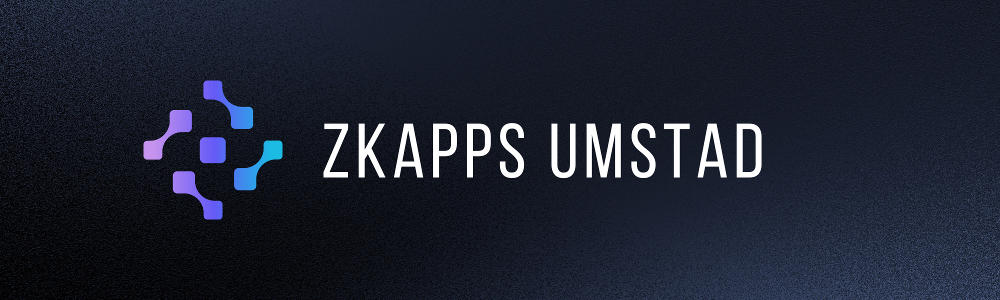
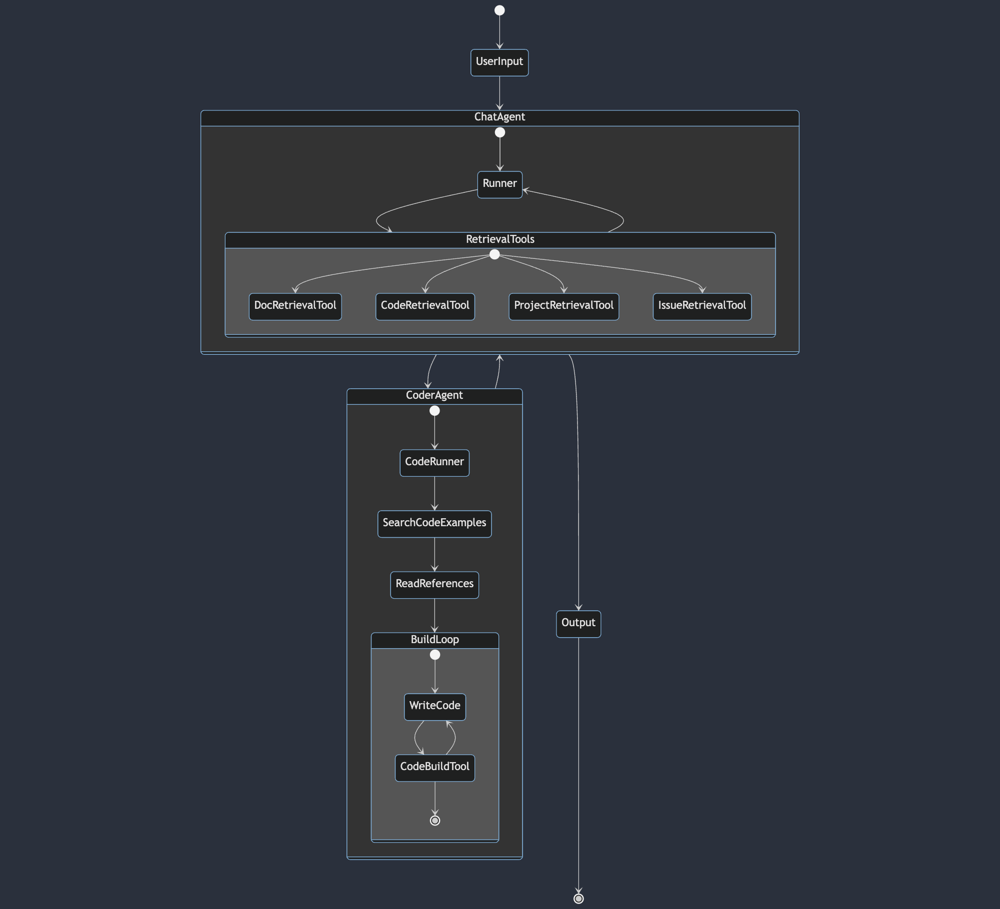

## Introduction

zkApps Umstad AI Assistant, your expert guide in the world of MINA Protocol, o1js. This agent provides in-depth assistance with zkApps o1js which is specifically designed to assist developers working on zkApps development powered by the GPT language model. This project includes two main application:

- **Web Application Chatbot:** [zkappsumstad.com](zkappsumstad.com)
- **CLI Agent:** [zkappumstad](https://pypi.org/project/zkappumstad/)

# zkApps Umstad Chatbot

## Features

The Umstad AI Assistant offers a comprehensive range of features designed to support developers in various aspects of the MINA Protocol and o1js:

1. **Documentation & General Knowledge:**

   - Access to extensive resources including the Mina Protocol documentation, o1js guides, and Auro Wallet information.
   - Integration with Mina Book and Mina Blog for up-to-date knowledge and insights.
   - Availability of various project documentations to enhance understanding and application.

2. **Example Codebase:**

   - Embedded code examples within the documentation for practical reference.

3. **Projects Repositories:**

   - Embedded codebase of zkApps projects.

4. **Community Interaction and Issue Tracking:**

   - Embedded and processed integration with the Mina Protocol Discord channels, specifically zkapps-developers and zkapps-questions, for community support and engagement.
   - Direct access to o1js GitHub Issues, providing insights into current challenges, bugs, and solutions within the community.

5. **Mainnet Blockchain Information Access:**
   - Direct access to Blockchain Summary, Block and Account Information utilizing Mina Explorer API.
   - Current MINA Price utilizing Coingecko API(TODO: Fix Fetching issue for deployment)

## Best Practices for Asking Questions

1. **Be Specific:** Clearly state your issue or the topic you need assistance with.

2. **Querying issues, errors, problems:** Begin with "I have an issue ..." or "I have a problem ..." for asking about errors, issues, problems, discussion, strange questions etc in order to utilize Issue Tool which queries the Issue Vectors which includes Discord and Github data.

3. **Do not extend the conversation:** Even though `gpt-4-1106-preview` can handle overlong contexts, it is strongly advised that not to extend the conversation too much(For now, ideal 3 questions). Just create new chat after 2-3 questions because every query creates crowded context.

## Technical Details

### Architecture Overview

### Backend Technologies

- **Language and Frameworks:** Built using Next.js functions, OpenAI node.js ensuring robust and scalable performance.
- **Database:** Uses vercel KV db.
- **APIs:** Uses Vercel Functions.

### Security and Compliance

- **Data Privacy:** We store your conversations in the KV db. Do not share confidentials, private keys etc. We are not responsible for Vercel's security.
- **OPENAI API KEY:** Application stores your OpenAI API KEY on the browser local storage. So, if you are using shared computer, please remove your key in the settings panel.

# zkApp Umstad CLI Agent

## Introduction

Introducing the zkApps Umstad AI Agent, your specialized assistant in the realm of the MINA Protocol and o1js. This agent, powered by the advanced GPT language model, is tailored to support developers in creating, debugging and testing zkApps smart contracts. It offers comprehensive guidance and expertise specifically for those working on zkApps development within the MINA ecosystem.

## Requirements
- Python 10 or above

## Installation

```bash
pip install zkappumstad
```

It is suggested that before using the tool create a folder and use it inside the folder.

```bash
mkdir new_folder
cd new_folder
```

Create .env.local file and add your api key like this:
```bash
OPENAI_API_KEY=XXXXXXXX
```
You must first activate a Billing Account here: https://platform.openai.com/account/billing/overview
Then get your OpenAI API Key here: https://platform.openai.com/account/api-keys
And need to get access GPT-4 Models

Create zk project and wait 10-15 seconds:
```bash
zkumstad-create
```

Go into the zkapps project folder and you can optionally open the project in editor:
```bash
cd initial_project
code .
```

Then, you can run and use the tool:
```bash
zkumstad-start
```

## Features & Architecture
Currently uses our own API to send queries. No need to post your OPENAI API KEY. However, it will be needed to POST the query with OPENAI API KEY later on.


#### Retrieval Tools
- Documentations
- Code Snippets
- Projects
- Issues

#### Coder Agent
- Gets related context and writes code
- Builds and gets errors
- Debugs errors
- Fix and retry code

## Usage
#### Commands
- ```zkumstad-start```: Runs the tool.
- ```zkumstad-create```: Initialize zkapps project named initial_project.
- ```zkumstad-help```: Display commands
- You can save your conversations by writing 'save' to console as a Markdown file.
- You can reset the conversation by writing 'reset'.
- Write 'quit' to terminate the agent.

#### Specifications
- You Must Delete smart contract and test files from src folder before creating new contract in order to build.

### Best Practices for Agent
- Specify your project requirements in detail and collaborate with the AI Agent.
- In order to query about issues, errors etc. start with "I have an issue...".

# Eval
Evaluation dataset is prepared for Mina Docs to evaluate the performance of the agent. It is compared against chatgpt.
table below shows the results of the evaluation, agent, accuracy, average latency.

| Agent | Accuracy | Latency |
| --- | --- | --- |
| chatgpt-3.5 | 51.5% | 1.969 seconds |
| chatgpt-4 | 69.5% | 10.594 seconds |
| umstad | 79.75% | 27.796 seconds |

Here we saw that our agent is more accurate than chatgpt-4 but slower. Because it is using chatgpt-4 and some additional tools to get more accurate results. Chatgpt-3.5 is the fastest but least accurate. We are planning to improve the speed of the agent.

# Support

For any technical issues or further inquiries, please contact our support team at [berkingurcan@gmail.com](mailto:berkingurcan@gmail.com).

# Side Projects & Future Applications

### Helper Projects

- **[Discord Scraper](https://github.com/berkingurcan/discord-qa-scrapper):** Project for scraping discord data
- **[Vector Uploaders](https://github.com/UmstadAI/uploaders):** Data processor and uploaders
- **[Thread Uploader](https://github.com/UmstadAI/Thread-Uploader)**: Thread Uploader for Discord Mods

### Side & Future Projects

- **[Umstad API](https://github.com/UmstadAI/zkAppUmstad/blob/main/app/api/embeddings/route.ts):** If you don't want to use zkappumstad applications for any reason, you can use the API for your own purposes by POSTING API KEY
- **Discord Umstad(TODO):** Discord Bot which uses Umstad API, just uses Discord Chat Interface.
- **Beginner Template Umstad(TODO):** Uses 20+ Perfect Smart Contract and provides them with very changes.
- **Umstad the Teacher(TODO):** Interactive learning platform(think about cryptozombies) which utilizes Beginner Template Umstad.
- **GPT Store Umstad(TODO):** Umstad in the GPT Store

# Acknowledgements

Special thanks to the Mina Protocol zkIgnite program for funding the project and all contributors to this project. 

Very special thanks to [Yunus](https://github.com/yunus433), [Ilya](https://github.com/iluxonchik/), [Filip](https://github.com/ffilipovicc98), [DFST](https://github.com/dfstio), [Santiago](https://github.com/scammi) for all feedbacks and contributions.
