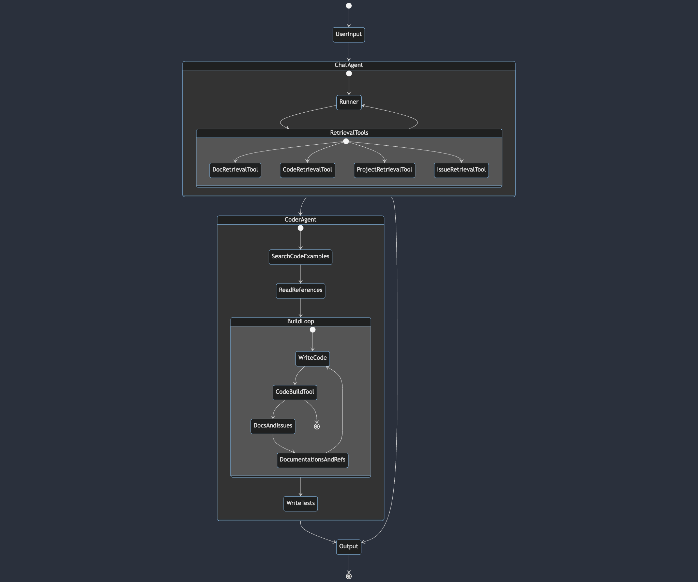

# zkApp Umstad CLI Agent

## Introduction

Introducing the zkApps Umstad AI Agent, your specialized assistant in the realm of the MINA Protocol and o1js. This agent, powered by the advanced GPT language model, is tailored to support developers in creating, debugging and testing zkApps smart contracts. It offers comprehensive guidance and expertise specifically for those working on zkApps development within the MINA ecosystem.

## Installation

```bash
pip install zkappumstad
```

It is suggested that before using the tool create a folder and use it inside the folder.

```bash
mkdir new_folder
cd new_folder
```

Create zk project and wait 10-15 seconds:
```bash
zkumstad-create
```

Go into the zkapps project folder and you can optionally open the project in editor:
```bash
cd initial_project
code .
```

Then, you can run and use the tool:
```bash
zkumstad-start
```

## Features & Architecture


#### Retrieval Tools
- Documentations
- Code Snippets
- Projects
- Issues

#### Coder Agent
- Gets related context and writes code
- Builds and gets errors
- Debugs errors
- Fix and retry code


## Usage


### Best Practices for Agent

TODO


# Support

For any technical issues or further inquiries, please contact our support team at [berkingurcan@gmail.com](mailto:berkingurcan@gmail.com).

# Acknowledgements

Special thanks to the Mina Protocol zkIgnite program for funding the project and all contributors to this project.
